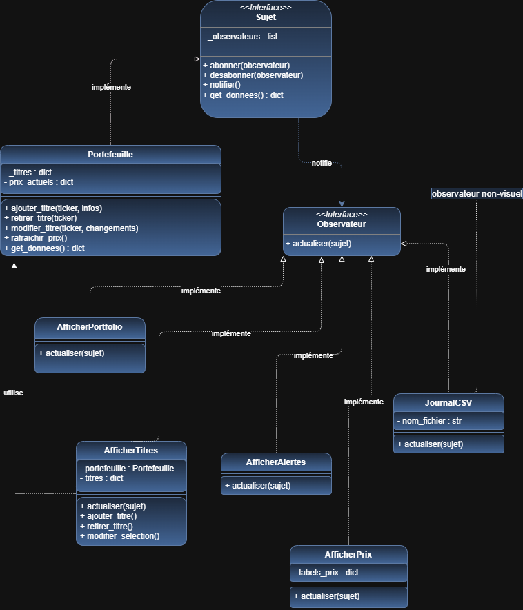

# TP1 — Suiveur de portefeuille boursier

## Présentation

Ce projet refactorise une application de suivi de portefeuille boursier en appliquant le **patron Observateur**.

Les prix sont récupérés avec `yfinance` toutes les 30 secondes. Le portefeuille notifie ensuite les observateurs pour actualiser les affichages et enregistrer les données.

## Installation et lancement

Créer l’environnement virtuel :

```bash
python -m venv venv
```

L’activer selon votre système :

```powershell
# Windows — PowerShell
.\venv\Scripts\Activate
```

```bash
# Linux / macOS
source venv/bin/activate
```

Installer les dépendances et lancer l’application :

```bash
pip install -r requirements.txt
python main.py
```

## Fonctionnalités

- Affichage des prix et de leur variation depuis l’ouverture.
- Calcul et affichage de la valeur totale du portefeuille et de sa variation.
- Alertes visuelles selon les seuils définis pour chaque titre.
- Ajout de titres avec leur quantité et leurs seuils d’alerte.
- Modification des quantités et des seuils d’alerte.
- Retrait des titres du portefeuille.
- Enregistrement des prix dans `portfolio.csv` à chaque rafraîchissement.

## Organisation du projet

- `main.py` : crée les objets, abonne les observateurs et programme le rafraîchissement.
- `modeles/` : contient la classe abstraite `Sujet` et le sujet concret `Portefeuille`.
- `observateurs/` : contient la classe abstraite `Observateur` et les cinq observateurs concrets.
- `views/` : contient la fenêtre principale et les styles de l’interface.
- `docs/UML.png` : présente le diagramme de classes.
- `app.py` : conserve l’application originale avant le refactoring.
- `requirements.txt` : contient les dépendances nécessaires.

## Fonctionnement du patron Observateur

`Sujet` fournit les méthodes `abonner()`, `desabonner()` et `notifier()`. Il impose également une méthode `get_donnees()`.

`Portefeuille` hérite de `Sujet` et conserve les titres et les prix. Sa méthode `rafraichir_prix()` récupère les prix, les stocke, puis appelle `notifier()`.

La notification appelle `actualiser(sujet)` sur chaque observateur abonné. Chaque observateur récupère les données avec `get_donnees()`, qui retourne un dictionnaire contenant les titres et les prix actuels.

Les cinq observateurs sont :

- **AfficherPrix** : affiche les prix et leurs variations depuis l’ouverture.
- **AfficherPortfolio** : calcule et affiche la valeur totale du portefeuille et sa variation.
- **AfficherAlertes** : affiche les alertes selon les seuils des titres.
- **AfficherTitres** : synchronise la liste des titres et fournit les formulaires d’ajout, de modification et de retrait. Ces formulaires appellent les méthodes de `Portefeuille`.
- **JournalCSV** : observateur non visuel qui enregistre les prix dans un fichier CSV.

Les méthodes d’ajout, de modification et de retrait du portefeuille notifient également les observateurs.

## Journal CSV

Chaque ligne de `portfolio.csv` contient :

```text
date et heure,ticker,prix actuel,prix à l’ouverture
```

Une ligne par titre disposant d’un prix est ajoutée à chaque notification. Les anciennes lignes sont conservées.

## Diagramme UML

Le diagramme de classes présente le sujet, les cinq observateurs et leurs relations.

